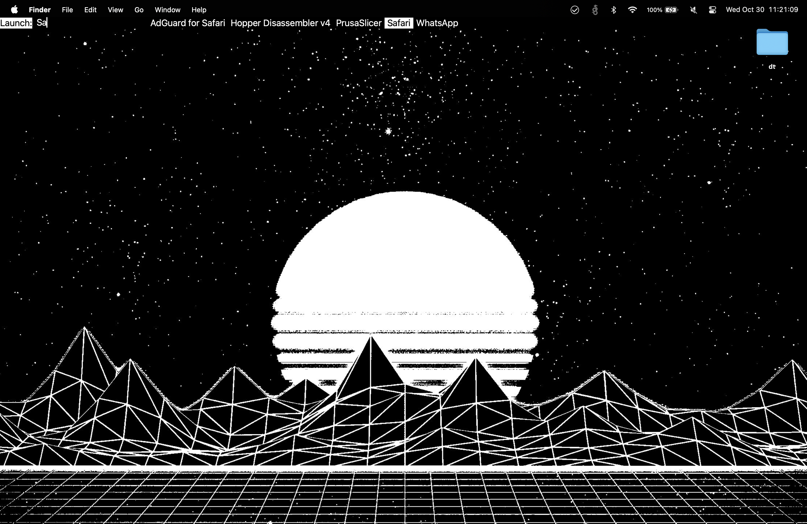

# FMenu (dmenu clone for macOS)

Simple dmenu clone for macOS, written in Swift, with SwiftUI.

# Installation

- Copy FMenu.app to /Applications folder.
- Create alias, i.e. add `alias fmenu="/Applications/FMenu.app/Contents/MacOS/FMenu` to your shell profile.

# Usage

- Application launcher:

```zsh
#!/bin/zsh

source /Users/flavian/.zshrc

\ls /Applications | grep "\.app$" | sed 's/\.app$//' | fmenu -p Launch: | xargs -I {} open "/Applications/{}.app"
```


